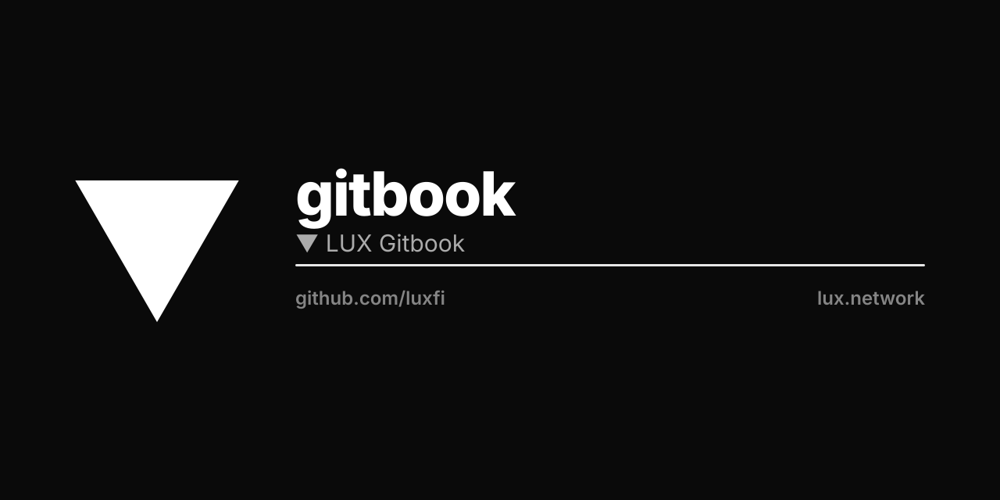

# About

## Getting started

Lux Finance is a future-yield-backed synthetic asset protocol governed by a DAO. The protocol gives you advances on various yield farming strategies via a synthetic token. The token represents a fungible claim on the underlying collateral in the Lux protocol, where the claim has to be made by a depositor of that collateral. The DAO will focus on funding projects that will help the Lux ecosystem grow, as well as the greater blockchain community.

What Does Lux Do?

Imagine a bank. You deposit money, and the bank pays you interest on your deposit. There's a credit card attached to the account. The card allows you to spend up to 50% of the asset you have deposited. In order to access this debt, you sacrifice a small percentage of its value upfront. There's no interest on the debt. There are no monthly payments to make. Your debt is denominated in the asset you deposit, so there are no liquidations. Instead, the interest you earn on your total initial deposit pays off any debt you have, automatically. Alchemix offers this product, in DeFi form: Alchemix is Self-Paying, Interest-Free, Non-Liquidating Loans.

How do I use it?

Alchemix currently offers alUSD to borrow against select USD-pegged stablecoins, and alETH to borrow against ETH.

**Deposit:** Select a yield strategy and then add collateral (Stablecoins or ETH) to that strategy.

**Borrow:** Borrow up to the acceptable collateralization ratio and receive a synthetic alAsset representing future yield equivalent to the borrowed amount.&#x20;

**Convert:** Swap the alAsset to any other token via a DEX or DEX Aggregator (check the current alAsset price before doing so). alAssets can also be used directly on some DeFi protocols.

**Spend:** Do anything with the loan (buy more crypto, take a vacation, cash out to savings, and many more options!)

**Wait:** The user's chosen yield strategy will go to work earning interest on the full initial deposit - the harvested yield will pay down their debt automatically over time.

**Withdraw, Borrow, Repay, or Self-Liquidate:** At any time, users can withdraw principal or borrow more, up to the collateralization ratio, or self-liquidate to gain their collateral minus any outstanding debt. Users may also repay their loans if they wish (with the respective alAsset or underlying token). Alchemix always views 1 alAsset as equivalent to 1 underlying asset (i.e., 1 alUSD = 1 DAI) for the purpose of borrowing, self-liquidating, and repaying loans.&#x20;

